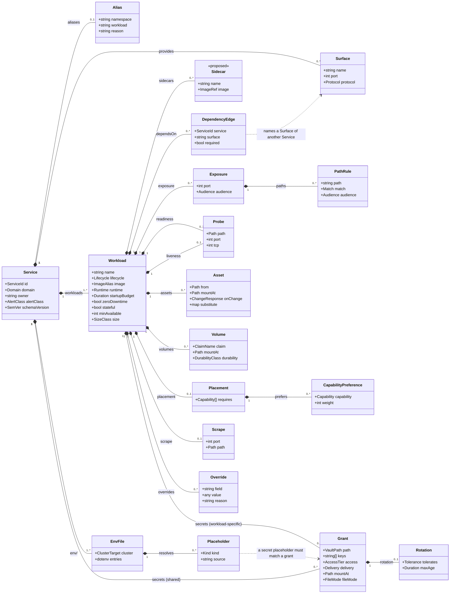

# Chapter 10 — Service Intent

Layer 1. The only layer a human authors, and the only layer that lives in a
Service's own repository.

Two rules govern everything below, and every field is justified against one of
them:

1. **Service Intent contains no mechanisms.** A field belongs here only if it
   states a requirement. `RollingUpdate`, `nodeSelector`, `IngressRoute`,
   `VaultStaticSecret` and `statefulset` are mechanisms and appear nowhere.
2. **Service Intent contains no contended values.** A value that must be unique
   across the estate, or that draws on a shared finite resource, is assigned by
   layer 2 ([ADR-0003](../../docs/adr/0003-contention-decides-authority.md)). A
   Service expresses a need and reads the assignment back from its generated
   `resolved.yml` ([ADR-0017](../../docs/adr/0017-resolved-deployment-publish-back.md)).

## Two artefacts

Layer 1 is authored as two kinds of file:

| file | owns |
|---|---|
| `platform/service.yml` | shape: workloads, surfaces, dependencies, exposure, probes, volumes, placement, and secret **access** |
| `platform/env/<workload>/base.env` + `platform/env/<workload>/<cluster>.env` | every environment variable that Workload receives |

The split that matters is not file-level but concern-level. A secret's **access**
is declared in `service.yml`, beside the `dependsOn` edge that motivates it; the
**environment variable** that carries it is a placeholder in the env file. Each
file therefore checks the other: an env file referencing a secret with no grant is
an unauthorised reference, and a grant with no reference is a dead grant.

```yaml
apiVersion: intent.jorisjonkers.dev/v1
kind: Service
schemaVersion: 1.0.0
```

The `apiVersion` deliberately does not reuse `deployment.jorisjonkers.dev`, which
three mutually incompatible documents already share — the defect
[ADR-0002](../../docs/adr/0002-three-layer-meta-model.md) exists to fix. Each
layer gets its own namespace. `schemaVersion` is an exact match against the
installed toolkit ([ADR-0013](../../docs/adr/0013-schema-version-lockstep.md)).

## The model



The diagram is embedded rather than kept as a separate `.mmd`. A standalone
`.mmd` does not render on GitHub, so it would be invisible in exactly the review
this chapter exists for.

## Service

| field | required | notes |
|---|---|---|
| `id` | yes | The one referencable identity, estate-unique. [ADR-0004](../../docs/adr/0004-flat-service-identity.md) |
| `domain` | yes | Ownership grouping, owner of shared Secret Store paths, and the unit of Intent Fragment publication. [ADR-0015](../../docs/adr/0015-composition-by-oci-fragments.md) |
| `owner` | yes | Who is notified. |
| `alertClass` | yes | `none` \| `business-hours` \| `urgent` \| `page`. Urgency, never routing. [ADR-0012](../../docs/adr/0012-observability-by-class.md) |
| `aliases` | no | A deliberate divergence from a derived coordinate, with `reason`. |
| `provides` | no | Surfaces other Services may depend on, as a flat map of name to port integer. |
| `workloads` | yes | One or more. |

## Ports and surfaces

There is no `ports` list. A port is an **integer**, written where it is used:

```yaml
provides:
  http: 8080
  metrics: 9187
```

```yaml
exposure:
  - port: 8080
    audience: authenticated
readiness:
  path: /api/actuator/health/readiness
  port: 8080
scrape:
  port: 9187
  path: /metrics
```

The rendered Kubernetes port name is **the name of the `provides` surface
declaring that same integer**; where no surface declares it, the name derives
from the role — `http` for an exposure, `metrics` for a scrape. That rule
reproduces every port name the live cluster uses, because the live names already
are surface names: `http` (23 references), `metrics`, `db`, `smtp`, `sieve`, `s3`,
`submissions`.

`containerPort` entries are derived. They are documentational in Kubernetes —
traffic routes by `targetPort` regardless — so declaring them would be a third
place to state a number.

**One thing to settle:** the live cluster names Postgres's port `db` while the
surface a consumer would naturally write is `postgres`. Either the surface is
named `db`, or the rename is accepted as a parity entry. `submissions` and
`submission` both appear live, which is a separate inconsistency this rule
happens to expose.

## Workload

### Identity and lifecycle

`image` is an alias resolved to a digest through the images lock — never a tag,
never a digest here.

`lifecycle` is `service` or `job`. Not `deployment` / `statefulset` / `job`,
because those are mechanisms; the object kind derives from `lifecycle`, `stateful`
and `volumes`.

`runtime` selects the Runtime Profile: `jvm`, `python`, `node`, `static`, `none`.
`none` is correct for a third-party image and injects no profile values at all.

### Dependencies

```yaml
dependsOn:
  - {service: platform-postgres, surface: postgres}
  - {service: auth-api, surface: http, required: false}
```

Declared per Workload, so network policy is precise: within `knowledge`, the API
reaches Postgres while the ingest worker reaches RabbitMQ, and neither inherits
the other's egress. The Service's edge set is the union, and that union drives the
Reconcile Unit DAG and co-test membership. Chapter 16 covers what an edge derives.

### Configuration — env files

Configuration is authored as dotenv, not as a map in this document
([ADR-0007](../../docs/adr/0007-configuration-and-assets.md)):

Env files are **per Workload**, because Workloads of one Service do not share an
environment: `knowledge-api` and `knowledge-ingest-worker` overlap on the
RabbitMQ coordinates and on nothing else.

```
# platform/env/knowledge-api/base.env
SPRING_PROFILES_ACTIVE=prod
KNOWLEDGE_MODE=lite
DB_HOST=${dependency:platform-postgres.host}
DB_USER=${secret:platform/postgres#kb.user}
```

`base.env` carries everything that does not vary; one overlay per Cluster Target
carries only what differs, overlay winning key by key. With one cluster the
overlay is usually empty.

A literal is written literally. A derived value is a **named placeholder** —
`${dependency:…}` for a coordinate, `${secret:…}` for a secret. Writing a derived
value as a literal is a build error, and so is writing a Runtime Profile key at
all: `OTEL_*` and `PYROSCOPE_*` come from `runtime`, and an exceptional value goes
in `overrides`, not here.

The placeholder names the source; the key names the variable. That is what lets
`knowledge` write `DB_HOST` and `n8n` write `DB_POSTGRESDB_HOST` from the same
Postgres.

The renderer partitions the file: literal keys become plain env entries, and
`${secret:…}` keys become `envFrom` secretRef entries.

### Secrets

A `secrets` list declares what a Workload may do to a Secret Store path. It sits
at **whichever level the secret is shared**: on the Service when every Workload
holds it, on a Workload when only that one does
([ADR-0005](../../docs/adr/0005-credential-provisioning.md)).

```yaml
# on the Service: every Workload gets these
secrets:
  - path: secret/data/platform/postgres
    keys: [kb.user, kb.password]
    access: read
    delivery: env
    rotation: {tolerates: restart}

workloads:
  - name: knowledge-ingest-worker
    # on the Workload: only this one gets it
    secrets:
      - path: secret/data/knowledge-system/vault-deploy-key
        keys: [key]
        access: read
        delivery: file
        mountAt: /home/worker/.ssh/id_ed25519
        fileMode: "0400"
```

A Workload's effective set is the Service-level list plus its own. There is no
override or removal syntax: a Workload that must *not* hold a shared secret is
evidence the secret was never shared, and it moves down a level.

`access` is `read`, `self-renew`, `self-roll` or `custody`. `delivery` is `env`,
`file` or `self`. An env-delivered grant is bound by a `${secret:…}` placeholder
in the env file, and the two check each other: a `delivery: env` grant with no
placeholder is a dead grant, and a placeholder with no grant is an unauthorised
reference.

### Probes

```yaml
readiness:
  path: /api/actuator/health/readiness
  port: 8080
liveness:
  path: /api/actuator/health/liveness
  port: 8080
```

Two sibling declarations, each with its own path. **There is no fallback.** A
liveness probe pointed at a readiness endpoint turns a dependency outage into a
crash-loop, and the v2 model made that the default for anyone declaring one path
([ADR-0008](../../docs/adr/0008-runtime-mechanics-derived-from-intent.md)).

A service with no HTTP surface uses `tcp`:

```yaml
readiness: {tcp: 5432}
liveness:  {tcp: 5432}
```

A Workload with no listener declares the absence:

```yaml
probes: none        # knowledge-ingest-worker: no ports, nothing to probe
```

### Rollout

```yaml
startupBudget: 600s
zeroDowntime: true
```

Derived from these plus `stateful` and `volumes`: rollout strategy, surge and
unavailability, startup probe period and threshold, progress deadline, and the
Flux health-check timeout class.

### Volumes

```yaml
volumes:
  - claim: knowledge-vault-clone
    mountAt: /var/lib/knowledge-vault
    durability: irreplaceable
```

`durability` is `reconstructible`, `recoverable` or `irreplaceable` — what the
data is worth, which only the owning Service knows. Backup job, retention sweep,
off-cluster copy and move-plan requirement all derive from it. Storage class and
size do not appear: they draw on finite node disk and are assigned.
`volumeClaimTemplate` is forbidden — a template ties the volume to the Workload's
name, so a rename orphans the claim.

### Exposure

```yaml
exposure:
  - port: 8080
    audience: authenticated
    paths:
      - {path: /mcp, match: exact, audience: anonymous}
      - {path: /,    match: prefix, audience: authenticated}
```

`audience` is the single vocabulary — `anonymous`, `authenticated`, `internal`,
`lan` — shared with route Tiers, replacing three disjoint vocabularies carrying
seven values ([ADR-0010](../../docs/adr/0010-exposure-by-audience.md)). No
hostname appears; six artefacts derive from this block.

### Placement

```yaml
placement:
  requires: [public-ingress]
  prefers:
    - {capability: arm64, weight: 50}
```

Capabilities, never labels. Both are validated against the node contract, and an
unsatisfiable **preference** is a build error — the scheduler discards it in
silence, which is the `gpu-model-gtx960m` trap that *"read as GPU-aware placement
while doing nothing"* ([ADR-0009](../../docs/adr/0009-node-facts-and-placement.md)).

Placement already implied is not declared: a `local-path` volume pins its Workload
to the node holding the PV, and the resolver states that.

### Assets and observability

```yaml
assets:
  - from: config/postgresql.conf
    mountAt: /etc/postgresql/postgresql.conf
    onChange: restart
scrape:
  port: 9187
  path: /metrics
```

An Asset is a declarative settings file in the application's own format, never
executable and never a program. `onChange` defaults to `restart`, which renders a
content-hashed object name so the change actually reaches the pod — 16 of 18
ConfigMaps today are plain, meaning an edit applies successfully and has no
effect.

### Overrides

```yaml
overrides:
  - field: progressDeadlineSeconds
    value: 600
    reason: nginx pods, ~10-20Mi each; the derived 1800 assumes a JVM cold start.
```

Overrides a **derivation**, never an **assignment**
([ADR-0018](../../docs/adr/0018-derived-value-overrides.md)).

## What layer 1 may never contain

A build error, not a warning:

| forbidden | where the value comes from |
|---|---|
| a hostname | assigned; read from `resolved.yml` |
| a namespace | derived from `id`, or an alias |
| a node label or selector | `placement.requires` |
| `replicas` | assigned from `minAvailable` and capacity |
| storage class, volume size | assigned |
| a Reconcile Unit or `platform.layer` | derived from the edge set |
| an image tag or digest | the images lock |
| a `ports` list, or a port as a string | an integer at its point of use |
| `RollingUpdate`, `maxSurge`, `progressDeadlineSeconds` | derived; `overrides` if exceptional |
| `statefulset` / `deployment` | derived from `lifecycle` + volumes |
| a liveness probe with no path | state it, or use `tcp`, or `probes: none` |
| a Dependency Coordinate as a literal | `${dependency:…}` |
| a Runtime Profile key in an env file | `runtime`; `overrides` if exceptional |
| a secret value, anywhere | a grant plus `${secret:…}` |
| a secret grant with no reference | remove it — it is a dead grant |
| a route tier, middleware, or `authMode` | `audience` |
| a `volumeClaimTemplate` | declare the claim cluster-side |
| an executable Asset | an image |

## Still to be graded

Three fields no decision in the register covers, marked `<<proposed>>` in the
diagram:

1. **`sidecars`.** A Workload holds more than one container, and this is not an
   edge case: `postgres` runs `postgres-exporter` on 9187, `stalwart` runs a
   `stalwart-apply` sidecar, `agent-runner` carries the `agent-gateway` jar.
2. **`size`.** Requests and limits draw on finite node capacity, so rule 2 forbids
   declaring them. Proposed as a closed class mapped by the cluster context, in
   the manner `timeoutClass` already works.
3. **`minAvailable`.** `replicas` is contended for the same reason, and
   `auth-api`'s two replicas were a capacity decision on freed Frankfurt budget,
   not an availability requirement.

## Worked examples

| example | what it exercises |
|---|---|
| [`knowledge.service.yml`](examples/knowledge.service.yml) + [`env`](examples/knowledge-api.base.env) | two Workloads, two runtimes, five path rules, `probes: none`, secrets at **both** levels, a `0400` file secret, an `irreplaceable` volume |
| [`auth-api.service.yml`](examples/auth-api.service.yml) + [`env`](examples/auth-api.base.env) | `delivery: self` with `tolerates: reload`, a `self-roll` Transit grant, four dependencies, inbound-derived CORS |
| [`platform-postgres.service.yml`](examples/platform-postgres.service.yml) + [`env`](examples/platform-postgres.base.env) | third-party image with `runtime: none`, a proposed sidecar, TCP probes, a static Asset, `provides` consumed by eight Services |

The env-file-to-`secrets` cross-check has been run against all three example
sets. `knowledge-api` has 5 placeholders matching 5 env-delivered keys, and its ingest
worker 4 more against the same Service-level grants;
`platform-postgres` has 1 matching 1; `auth-api` has **0 and 0**, because all
three of its grants are `delivery: self` — which demonstrates the check does not
false-positive on runtime fetch. No dead grants, no unauthorised references, and
no `delivery: env` paired with `tolerates: reload`.
