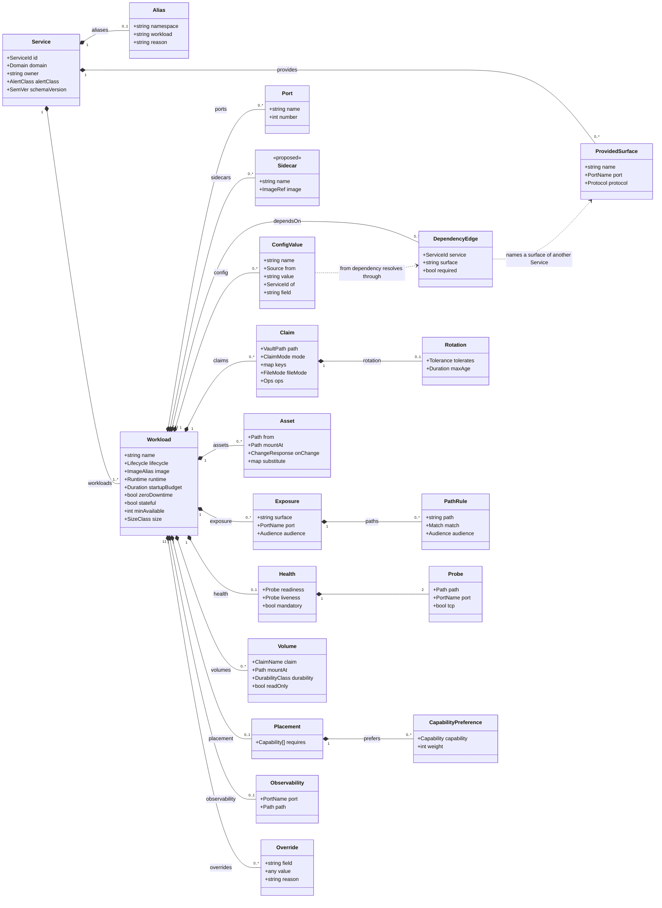

# Chapter 10 — Service Intent

Layer 1. The only layer a human authors, and the only layer that lives in a
Service's own repository.

Two rules govern everything below, and every field here is justified against one
of them:

1. **Service Intent contains no mechanisms.** A field belongs here only if it
   states a requirement. `RollingUpdate`, `nodeSelector`, `IngressRoute`,
   `VaultStaticSecret` and `statefulset` are mechanisms and appear nowhere in
   this layer.
2. **Service Intent contains no contended values.** A value that must be unique
   across the estate, or that draws on a shared finite resource, is assigned by
   layer 2 ([ADR-0003](../../docs/adr/0003-contention-decides-authority.md)). A
   Service expresses a need for it and reads the assignment back from its
   generated `resolved.yml`
   ([ADR-0017](../../docs/adr/0017-resolved-deployment-publish-back.md)).

## Document identity

```yaml
apiVersion: intent.jorisjonkers.dev/v1
kind: Service
schemaVersion: 1.0.0
```

The `apiVersion` deliberately does not reuse `deployment.jorisjonkers.dev`. Three
mutually incompatible documents already share that string, which is the defect
[ADR-0002](../../docs/adr/0002-three-layer-meta-model.md) exists to fix. Each
layer gets its own namespace: `intent.` here, `resolved.` for layer 2, and layer
3 emits native objects of the target it is written for.

`schemaVersion` is an exact match against the installed toolkit
([ADR-0013](../../docs/adr/0013-schema-version-lockstep.md)).

## The model



The diagram is embedded here rather than kept as a separate `.mmd`. A standalone
`.mmd` does not render on GitHub, so it would be invisible in exactly the review
this chapter exists for — and a copy in both places is the duplication this
specification spends its time removing.

## Service

| field | required | notes |
|---|---|---|
| `id` | yes | The one referencable identity. Estate-unique, enforced at composition. [ADR-0004](../../docs/adr/0004-flat-service-identity.md) |
| `domain` | yes | Ownership grouping, and owner of any shared Secret Store paths this Service provides. Also the unit of Intent Fragment publication. [ADR-0015](../../docs/adr/0015-composition-by-oci-fragments.md) |
| `owner` | yes | Who is notified. Feeds notifier routing with `alertClass`. |
| `alertClass` | yes | `none` \| `business-hours` \| `urgent` \| `page`. Urgency, never routing. [ADR-0012](../../docs/adr/0012-observability-by-class.md) |
| `aliases` | no | A deliberate divergence between the Service Id and a coordinate derived from it, with `reason`. [ADR-0004](../../docs/adr/0004-flat-service-identity.md) |
| `provides` | no | Named Surfaces other Services may depend on. A provider declares a port once; every consumer names the Surface. [ADR-0011](../../docs/adr/0011-dependency-edges.md) |
| `workloads` | yes | One or more. |

Derived from the Service and never declared: `namespace`, Reconcile Unit and its
ordering, image digests, and every hostname.

## Workload

### Identity and lifecycle

`name` is local to the Service. `image` is an alias resolved to a digest through
the images lock — never a tag, never a digest in this layer.

`lifecycle` is `service` (long-running) or `job` (runs to completion). It is not
`deployment` / `statefulset` / `job`, because those are mechanisms and rule 1
forbids them; the object kind is derived from `lifecycle`, `stateful` and
`volumes`. `postgres` runs `type: Recreate` today precisely because it holds a
`ReadWriteOnce` volume, which is the derivation working by hand already.

`runtime` selects the Runtime Profile: `jvm`, `python`, `node`, `static`, or
`none`. `none` is the correct answer for a third-party image, and it means no
profile values are injected at all.

### Dependencies

```yaml
dependsOn:
  - {service: platform-postgres, surface: postgres}
  - {service: auth-api, surface: http, required: false}
```

Declared per Workload, not per Service, so network policy is precise: within
`knowledge`, `knowledge-api` reaches Postgres while
`knowledge-ingest-worker` reaches RabbitMQ, and neither inherits the other's
egress. The Service's edge set is the union of its Workloads' edges, and that
union is what drives the Reconcile Unit DAG and co-test membership. This refines
the wording in [ADR-0006](../../docs/adr/0006-reconcile-unit-is-derived.md) and
[ADR-0011](../../docs/adr/0011-dependency-edges.md), which both say "the
Service's `dependsOn`" — the decision is unchanged, the level is one deeper.

Four things derive from one edge: reconcile ordering, Dependency Coordinates,
NetworkPolicy egress, and co-test membership.

### Configuration

```yaml
config:
  SPRING_PROFILES_ACTIVE: {from: literal, value: prod}
  DB_HOST: {from: dependency, of: platform-postgres, field: host}
```

`from` is `literal` or `dependency`. Every key declares its source
([ADR-0007](../../docs/adr/0007-configuration-and-assets.md)), and a key whose
value the platform derives may not be authored — `DB_HOST` as a literal is a
build error, as is any `OTEL_*` or `PYROSCOPE_*` key belonging to a Runtime
Profile.

A coordinate binds by name because consumers disagree about names: `knowledge`
reads `DB_HOST`/`DB_PORT`/`DB_NAME` and `n8n` reads
`DB_POSTGRESDB_HOST`/`DB_POSTGRESDB_PORT`/`DB_POSTGRESDB_DATABASE` from the same
Postgres.

Overriding a profile value uses `overrides`, not `config`. Earlier illustration
put an `overrides:` key inside a `config` entry; that would be a second mechanism
for one thing, so this chapter unifies on the Workload-level `overrides` list in
[ADR-0018](../../docs/adr/0018-derived-value-overrides.md).

### Secrets

```yaml
claims:
  - path: secret/data/platform/postgres
    mode: env
    keys: {kb.user: DB_USER, kb.password: DB_PASSWORD}
    rotation: {tolerates: restart}
```

`path` is a full KV-v2 data path — the same addressing
`VaultSecretProvider.getSecret(path, key)` already takes. `mode` is one of four
([ADR-0005](../../docs/adr/0005-credential-provisioning.md)):

| mode | shape of `keys` | renders |
|---|---|---|
| `env` | `{vaultKey: ENV_NAME}` | a VSO sync, a Secret, and named `env` entries |
| `fetch` | a list of keys | a policy, a Kubernetes auth role, and `spring.cloud.vault` wiring. No Secret, no env |
| `file` | `{vaultKey: /path/on/disk}` plus `fileMode` | a projected file |
| `write` | `ops` on a path prefix | a policy granting writes under a prefix |

`rotation.tolerates: reload` is only valid under `mode: fetch`. A pod's
environment is fixed for its lifetime, so `reload` with `mode: env` is a build
error rather than a silent failure at rotation time.

### Assets

```yaml
assets:
  - from: config/postgresql.conf
    mountAt: /etc/postgresql/postgresql.conf
    onChange: restart
```

An Asset is a declarative settings file in the consuming application's own
format. It may not be executable and may not be a program: scripts belong in an
image. `onChange` defaults to `restart`, and `restart` renders a content-hashed
object name so the change actually reaches the pod — 16 of 18 ConfigMaps today
are plain, meaning an edit applies successfully and has no effect.

`substitute` replaces named placeholders from declared sources. It is not a
template language.

### Exposure

```yaml
exposure:
  - surface: primary
    port: http
    audience: authenticated
    paths:
      - {path: /mcp, match: exact, audience: anonymous}
      - {path: /, match: prefix, audience: authenticated}
```

`audience` is the single vocabulary — `anonymous`, `authenticated`, `internal`,
`lan` — shared with route Tiers, which replaces three disjoint vocabularies
carrying seven values between them
([ADR-0010](../../docs/adr/0010-exposure-by-audience.md)). No hostname appears
here; six artefacts derive from this block, including the hostname, the Tier, the
middleware chain, the reachability entry and the external health check.

### Health and rollout

```yaml
health:
  readiness: {path: /api/actuator/health/readiness, port: http}
  liveness:  {path: /api/actuator/health/liveness, port: http}
  mandatory: true
startupBudget: 600s
zeroDowntime: true
```

A probe is HTTP (`path` + `port`) or TCP (`tcp: true` + `port`). TCP is not
optional to support: `postgres` uses `tcpSocket` on port `db` for both probes
today, as do the other data services.

`mandatory: false` records a deliberate absence — `knowledge-ingest-worker` has
no ports and nothing to probe, and saying so distinguishes it from an oversight.

Derived from `startupBudget`, `zeroDowntime`, `stateful` and `volumes`: rollout
strategy, surge and unavailability, startup probe period and threshold, progress
deadline, and the Flux health-check timeout class
([ADR-0008](../../docs/adr/0008-runtime-mechanics-derived-from-intent.md)).

### Volumes

```yaml
volumes:
  - claim: knowledge-vault-clone
    mountAt: /var/lib/knowledge-vault
    durability: irreplaceable
```

`durability` is `reconstructible`, `recoverable` or `irreplaceable` — what the
data is worth, which only the owning Service knows. Backup job, retention sweep,
off-cluster copy and move-plan requirement all derive from it. Storage class and
size do not appear: they draw on finite node disk and are assigned.

`volumeClaimTemplate` is forbidden. A template ties the volume to the Workload's
name, so a rename orphans the claim and starts empty.

### Placement

```yaml
placement:
  requires: [public-ingress]
  prefers:
    - {capability: arm64, weight: 50}
```

Capabilities, never labels
([ADR-0009](../../docs/adr/0009-node-facts-and-placement.md)). An unsatisfiable
`requires` leaves a pod `Pending`, which is loud; an unsatisfiable `prefers` is
discarded by the scheduler in silence, so **both** are validated against the node
contract and an unsatisfiable preference is a build error. That is the
`gpu-model-gtx960m` trap, which "read as GPU-aware placement while doing
nothing".

Placement that is already implied is not declared. A `local-path` volume pins its
Workload to the node holding the PV, and the resolver states that rather than
every stateful Service repeating it.

### Observability

```yaml
observability:
  scrape: {port: http, path: /api/actuator/prometheus}
```

The scrape surface stays declared because it genuinely varies —
`/api/actuator/prometheus` for `auth-api`, `/metrics` for the Postgres exporter.
Everything else derives: ServiceMonitor, internal and external health checks,
the PrometheusRule (always carrying `release: metrics-stack`, without which a
rule is accepted and never evaluates), and notifier routing.

### Overrides

```yaml
overrides:
  - field: progressDeadlineSeconds
    value: 600
    reason: nginx pods, ~10-20Mi each; the derived 1800 assumes a JVM cold start.
```

Overrides a **derivation**, never an **assignment**. Hostname, namespace, node,
Secret Store path, Reconcile Unit and image digest are not overridable, because
they arbitrate shared resources and a local override reintroduces collision
([ADR-0018](../../docs/adr/0018-derived-value-overrides.md)).

## What Service Intent may never contain

A build error, not a warning:

| forbidden | why | where it comes from instead |
|---|---|---|
| a hostname | contended | assigned; read from `resolved.yml` |
| a namespace | contended | derived from `id`, or an alias |
| a node label or selector | mechanism, and contended | `placement.requires` |
| `replicas` | contended | assigned from `minAvailable` and capacity |
| storage class, volume size | contended | assigned |
| a Reconcile Unit or `platform.layer` | contended | derived from the edge set |
| an image tag or digest | mechanism | the images lock |
| `RollingUpdate`, `maxSurge`, `progressDeadlineSeconds` | mechanism | derived; `overrides` if genuinely exceptional |
| `statefulset` / `deployment` | mechanism | derived from `lifecycle` + volumes |
| a Dependency Coordinate (`DB_HOST`, …) | derived | `from: dependency` |
| a Runtime Profile value (`OTEL_*`, `PYROSCOPE_*`) | derived | the profile; `overrides` if exceptional |
| a route tier, middleware, or `authMode` | mechanism | `audience` |
| a `volumeClaimTemplate` | orphans data on rename | declare the claim cluster-side |
| an executable Asset | code, not configuration | an image |
| a raw secret value | — | a Claim |

## Still to be graded

This chapter had to propose three things that no decision in the register
covers. They are marked `<<proposed>>` in the diagram and should be graded before
this chapter is approved.

1. **`sidecars`.** A Workload can hold more than one container, and this is not
   an edge case: `postgres` runs `postgres-exporter` on 9187, `stalwart` runs a
   `stalwart-apply` sidecar, and `agent-runner` carries the `agent-gateway` jar.
   Proposed as a reduced-field list rather than promoting every Workload to a
   `containers` array, because the overwhelming majority have exactly one.
2. **`size`.** Resource requests and limits draw on finite node capacity, so
   rule 2 forbids declaring them. Proposed as a closed class mapped to
   requests/limits by the cluster context, in the manner `timeoutClass` already
   works. The alternative is that layer 1 says nothing about resources and the
   platform assigns blind.
3. **`minAvailable`.** `replicas` is contended for the same reason, and
   `auth-api`'s two replicas were a capacity decision, not an availability one —
   `live-divergence.md` is explicit that the UIs' Pi preference "was a capacity
   decision, not an architecture one". Proposed so a Service can state how many
   instances must be serving without claiming cluster capacity it does not own.

Two further items complete a shape rather than propose a policy, and need no
grading: probe kinds (`tcp`, forced by `postgres`'s live probes) and `lifecycle`
replacing `kind` (a direct application of rule 1).

## Worked examples

| example | what it exercises |
|---|---|
| [`knowledge.service.yml`](examples/knowledge.service.yml) | two Workloads, two runtimes, five path rules with mixed audiences, `mode: file` at `0400`, an `irreplaceable` volume, a deliberate `mandatory: false` |
| [`auth-api.service.yml`](examples/auth-api.service.yml) | `mode: fetch` with dynamic credentials and `tolerates: reload`, a Transit `write` grant, four dependencies, nine inbound-derived CORS origins, self-referencing exposure |
| [`platform-postgres.service.yml`](examples/platform-postgres.service.yml) | a third-party image with `runtime: none`, a proposed sidecar, TCP probes, a static Asset, `provides` consumed by eight Services, and an init script that becomes derived |
