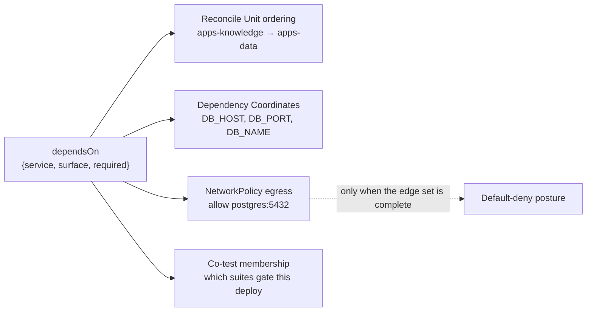
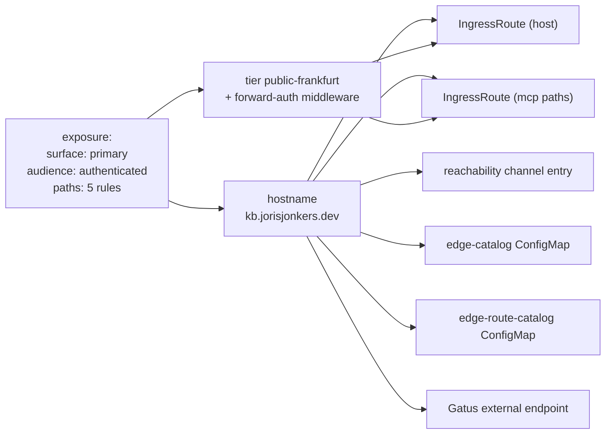

# Chapter 16 — Dependencies and the derivation map

Chapter 10 defined what a Service declares. This chapter defines what those
declarations *produce*, and gives the specification its one machine-checkable
property.

## The dependency edge

```yaml
dependsOn:
  - {service: platform-postgres, surface: postgres}
  - {service: auth-api, surface: http, required: false}
```

Three fields. `service` is a Service Id — the only referencable identity
([ADR-0004](../../docs/adr/0004-flat-service-identity.md)). `surface` names one
of that Service's declared `provides` entries, so a port is written once by the
provider and never restated by a consumer. `required` defaults to `true`.

Edges are declared per Workload (chapter 10), and the Service's edge set is the
union of its Workloads' edges.

## Direction matters

Four things derive from an edge read **outbound**, from the consumer:



And a fifth class derives from the **same edges read inbound** — from the
provider's side. These are the derivations a Service could never declare
locally, because no Service knows its own consumers:

| inbound derivation | evidence it is needed |
|---|---|
| a database and owning user per consumer | `init-databases.sh` creates `auth_db`, `agents_db`, `knowledge_db` and `n8n_db` — one per Service claiming a Postgres credential. 98 lines that the graph already knows. |
| NetworkPolicy **ingress** | a provider must admit its consumers; only the inbound set says who they are |
| co-test suite membership | 12 of ~25 test classes exercise `auth-api` *with* its consumers — `GrafanaOidc`, `N8nOidc`, `RabbitMqOidc`, `ForwardAuthChain`, `DownstreamOidcAuthorization` |
| browser origin allow-lists | `auth-api` hand-maintains `AUTH_CORS_ALLOWED_ORIGINS` with nine hostnames |
| rotation blast radius | "who breaks if I rotate this?" is the inbound set of a Secret Subtree path |

This is why [ADR-0014](../../docs/adr/0014-co-testing-by-relationship.md) puts
co-test declarations on the test project rather than on the Service, and why
[ADR-0015](../../docs/adr/0015-composition-by-oci-fragments.md) is a hard
dependency of this chapter: an inbound derivation is only computable over the
composed union.

## The derivation map

The normative set of derivations. Left column is declared in Service Intent;
right column is produced by layers 2 and 3.

```mermaid
flowchart LR
    subgraph DEC["Declared — Service Intent (layer 1)"]
        d_id["id"]
        d_dom["domain"]
        d_own["owner"]
        d_alert["alertClass"]
        d_prov["provides"]
        d_dep["dependsOn"]
        d_img["image"]
        d_run["runtime"]
        d_cfg["config"]
        d_clm["claims"]
        d_ast["assets"]
        d_exp["exposure"]
        d_hlth["health"]
        d_bud["startupBudget"]
        d_zdt["zeroDowntime"]
        d_life["lifecycle"]
        d_sf["stateful"]
        d_vol["volumes"]
        d_plc["placement"]
        d_scr["observability.scrape"]
        d_ovr["overrides"]
    end

    subgraph DER["Derived — assignments and Deliverables (layers 2 and 3)"]
        r_ns["namespace"]
        r_host["hostname"]
        r_tier["route tier + middleware"]
        r_ru["Reconcile Unit + DAG"]
        r_node["node assignment"]
        r_vp["Secret Store path grant"]
        r_dig["image digest"]
        r_rep["replicas"]
        r_strat["rollout strategy + surge"]
        r_prb["container probes"]
        r_dl["progressDeadlineSeconds"]
        r_tc["Flux health timeout class"]

        k_dep["Deployment / StatefulSet / Job"]
        k_svc["Service"]
        k_sa["ServiceAccount"]
        k_cm["ConfigMap"]
        k_sec["VaultStaticSecret / Secret"]
        k_pol["Vault policy + auth role"]
        k_ir["IngressRoute"]
        k_np["NetworkPolicy"]
        k_sm["ServiceMonitor"]
        k_pr["PrometheusRule"]
        k_gat["Gatus endpoint"]
        k_rch["reachability entry"]
        k_edg["edge catalogs"]
        k_flx["Flux Kustomization"]
        k_bkp["backup CronJob + sweep"]
        k_ntf["notifier route"]
        k_res["resolved.yml"]
    end

    d_id --> r_ns
    d_id --> k_sa
    d_id --> r_dig
    d_dom --> r_ru
    d_dom --> r_vp
    d_own --> k_ntf
    d_alert --> k_pr
    d_alert --> k_ntf

    d_prov --> k_svc
    d_prov --> k_np
    d_prov --> k_gat

    d_dep --> r_ru
    d_dep --> k_flx
    d_dep --> k_np
    d_dep --> k_cm

    d_img --> r_dig
    d_run --> k_dep
    d_cfg --> k_dep

    d_clm --> k_sec
    d_clm --> k_pol
    d_clm --> r_vp
    d_clm --> k_np
    d_clm --> k_dep

    d_ast --> k_cm
    d_ast --> k_dep

    d_exp --> r_host
    d_exp --> r_tier
    d_exp --> k_ir
    d_exp --> k_rch
    d_exp --> k_edg
    d_exp --> k_gat
    d_exp --> k_np

    d_hlth --> r_prb
    d_hlth --> r_tc
    d_hlth --> k_gat
    d_bud --> r_prb
    d_bud --> r_dl
    d_zdt --> r_strat

    d_life --> k_dep
    d_sf --> k_dep
    d_sf --> r_tc
    d_vol --> k_dep
    d_vol --> r_strat
    d_vol --> r_node
    d_vol --> k_bkp

    d_plc --> r_node
    d_scr --> k_sm
    d_scr --> k_pr

    r_prb --> k_dep
    r_strat --> k_dep
    r_dl --> k_dep
    r_rep --> k_dep
    r_ns --> k_dep
    r_dig --> k_dep
    r_node --> k_dep
    r_host --> k_ir
    r_tier --> k_ir
    r_tc --> k_flx
    r_ru --> k_flx
    r_vp --> k_pol

    d_ovr -.->|"replaces one derived value"| r_dl
    r_ns --> k_res
    r_host --> k_res
    r_node --> k_res
    r_vp --> k_res
```



The map is dense on purpose and is not meant to be read by eye. Its value is
that the three properties below are **checkable by a script** over the
renderer's attribution table, which [ADR-0016](../../docs/adr/0016-deliverables-and-ledgers.md)
already requires every Deliverable to carry.

## The three properties

An earlier draft of the overview said the criterion was "any node with two
inbound arrows is a bled concern". That is wrong and is corrected here. A
`Deployment` legitimately draws on `image`, `config`, `claims`, `health`,
`placement` and more — many inbound arrows, no bleed. Convergence on an
*object* is normal; convergence on the same *field* of an object is the defect.

### 1. Totality — no Deliverable has in-degree zero

Every rendered object is reachable from at least one declaration. An object with
no inbound edge is hand-written, and must either become derived or be entered in
a Bidirectional Ledger with an owner and a reason.

This is the property that was violated seven ways over: `reachability.yml`, both
edge catalogs, both IngressRoutes and the Gatus endpoint each declared
`kb.jorisjonkers.dev` independently, with no declaration upstream of any of them.

### 2. Single authority — no field has two declaring sites

For each field of each Deliverable, exactly one declaration is its authority.
Checked against the attribution table rather than the diagram, because the
diagram is object-level and this property is field-level. That granularity gap
is deliberate: drawing it per-field would make the map unreadable without making
the check any stronger.

### 3. No dead declarations — no declaration has out-degree zero

A declared field that derives nothing is ceremony, and this property is the one
that would have caught the estate's clearest example.
`rollbackTargetRetention` was validated for `minimumDays >= 90` and
`acknowledged: true`, appeared in the readiness scorecard, was documented in
three `PLATFORM.md` files as failing *never*, and was read by no renderer or
adapter. Every service declared the identical value. Out-degree zero.

## Worked trace — one exposure declaration



One declaration, six artefacts, plus the two conformance tests that existed only
to detect when those six disagreed
(`route-auth-conformance.test.js`, `gatus-route-coverage.test.js`). Under
property 1 those tests have nothing left to check, because the six cannot
disagree — they share a single upstream.

## Worked trace — one credential claim

```yaml
claims:
  - path: secret/data/platform/postgres
    mode: env
    keys: {kb.user: DB_USER, kb.password: DB_PASSWORD}
    rotation: {tolerates: restart}
```

| derives | detail |
|---|---|
| `VaultStaticSecret` | targeting the Workload's namespace |
| `Secret` | projected, with the two named keys |
| container `env` | `DB_USER`, `DB_PASSWORD` bound by the declared names |
| Vault policy + Kubernetes auth role | read on the claimed path only |
| `rolloutRestartTargets` | from `tolerates: restart`, no longer hand-declared |
| engine choice | static, because `restart` does not require `fetch` |
| `NetworkPolicy` egress | to Vault |
| Secret Subtree cross-check | the `data` domain must list this Service as a reader |
| **inbound**, on the provider | one database and one owning user in `init-databases.sh` |

Nine derivations, one declaration. The ninth is only computable over the composed
union, which is the dependency this chapter has on ADR-0015.

## What the properties would have caught

| defect | property | how it presents |
|---|---|---|
| `kb.jorisjonkers.dev` in seven places | 1 | six Deliverables with in-degree zero |
| `rollbackTargetRetention` inert | 3 | a declaration with out-degree zero |
| `platform.layer` wrong in 7 of 7 services | 3 | out-degree zero — it fed a registry, never placement |
| 41 Gatus checks, no notifier | 1 | `notifier route` unreachable from any declaration |
| 60 duplicated `OTEL_*` lines | 2 | six declaring sites for one field |
| unsatisfiable `gpu-model-gtx960m` preference | 1 | a declaration pointing at a capability no node advertises |

## Open in this chapter

**The CORS predicate.** `AUTH_CORS_ALLOWED_ORIGINS` lists nine hostnames, and
the derivation above claims they are the inbound edge set projected onto
assigned hostnames. That shape is right, but the exact predicate is not
established: a browser origin is needed only by a consumer making cross-origin
requests *to* `auth-api`, whereas an OIDC redirect flow — which is what
`GrafanaOidc`, `N8nOidc` and `RabbitMqOidc` exercise — does not require a CORS
entry. So the derivation is probably "inbound edges declaring a browser
surface", not "all inbound edges". Confirm against `auth-api`'s actual CORS
usage before implementing, and record the predicate here.
