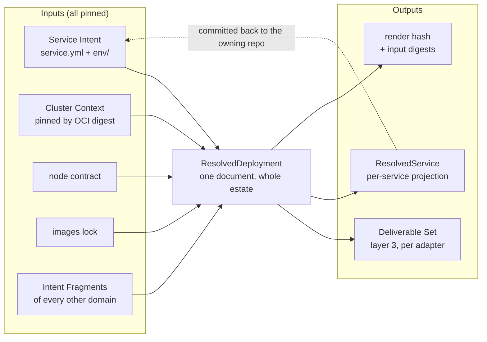

# Chapter 20 — Resolved Deployment

Layer 2. Never authored. It is where every platform decision is recorded, and it
is the reason layer 3 can contain none.

## The purity rule

Chapter 10 gave layer 1 two rules. Layer 2 has one, and it is the load-bearing
property of the whole specification:

> **Every assignment is a pure function of Service Intent, the pinned Cluster
> Context, and the pinned locks.** Same inputs, same output, always.

Nothing in layer 2 is allocated from a mutable pool, drawn from a counter, or
remembered between renders. There is no allocation registry and no assignment
state, which is why the render hash means something, why a render is reproducible
from its lock, and why publishing assignments back to a service repository cannot
drift.

The rule has teeth because it forces a decision whenever something *cannot* be a
pure function. Such a value must move either **up** into layer 1, where it is
declared and checked, or **sideways** into the pinned Cluster Context, where it is
platform data. It may not stay in layer 2 as remembered state.

### What that rule cost — a correction to ADR-0003

[ADR-0003](../../docs/adr/0003-contention-decides-authority.md) says a value is
platform-assigned if it must be unique estate-wide **or** draws on a shared finite
resource. Applied literally, that forbids declaring the Service Id, which must be
estate-unique — yet
[ADR-0004](../../docs/adr/0004-flat-service-identity.md) declares it and checks
uniqueness at composition.

That was not sloppiness; it is a real distinction the original rule conflated:

| kind | example | treatment |
|---|---|---|
| **identity** — must be unique, but is not drawn from a finite pool | Service Id, hostname label, claim name | **declared** in layer 1, uniqueness **checked** at composition |
| **pool** — drawn from a shared finite resource | node capacity, disk, a port on the shared edge, a Vault mount | **assigned** by layer 2, or held in the Cluster Context |

Hostnames are identity, and the evidence is decisive: **not one live hostname is
derivable from a Service Id.** `knowledge` serves `kb`, `auth-api` serves `auth`,
`home-portal` serves the apex, `headlamp` serves `dashboard`, `gatus` serves
`status`. `agents-api` serves **two** — `agents` and `agents-ws`. Any derivation
rule would need an exception for every case, which is not a rule.

So the hostname **label** is declared in layer 1 and checked unique; layer 2
assigns the fully-qualified name by combining it with the tier's hostname policy
and the cluster domain. This requires one change to chapter 10: an `exposure`
entry carries a `name`.

```yaml
exposure:
  - name: kb                    # identity: declared, checked unique
    port: 8080
    audience: authenticated
  # apex: true   for home-portal, which serves the bare domain
```

Layer 2 then assigns `kb.jorisjonkers.dev` as a pure function of
`name + tier.hostnamePolicy + cluster.publicDomain`. Nothing is allocated.

## One model, two views



`ResolvedDeployment` is a single document covering the whole composed estate,
because assignments are not separable: hostname uniqueness, the Reconcile Unit
DAG, inbound-edge derivations and the reader set of a secret path are all
global properties (chapter 16).

A Workload's effective grant set is the Service-level `secrets` list plus its
own, and layer 2 flattens that before deriving policies, so a shared grant
produces one policy statement per Workload that holds it rather than one per
Service.

`ResolvedService` is a **projection** of it — the slice belonging to one Service,
committed back to that Service's repository as `platform/resolved.yml`
([ADR-0017](../../docs/adr/0017-resolved-deployment-publish-back.md)). It is
derived from `ResolvedDeployment` by filtering, never computed separately, so the
two cannot disagree about what was decided.

```yaml
apiVersion: resolved.jorisjonkers.dev/v1
kind: ResolvedDeployment     # whole estate
---
apiVersion: resolved.jorisjonkers.dev/v1
kind: ResolvedService        # the projection committed back
```

Both are schema'd and versioned, which is what
[ADR-0002](../../docs/adr/0002-three-layer-meta-model.md) bought by naming this
layer at all. The previous shape had a whole-estate `ProjectModel` in memory
with no published schema, sharing the string `deployment.jorisjonkers.dev` with
the authoring format — which is the defect `CLAUDE.md` records as a trap rather
than a bug.

## The assignment catalogue

Normative. Every row is a pure function of its inputs.

| assigned | from | notes |
|---|---|---|
| `namespace` | `id`, or `aliases.namespace` | `app-system` for `home-portal` is an alias with a recorded reason |
| fully-qualified hostname | exposure `name` + tier `hostnamePolicy` + cluster domain | identity declared, name assembled |
| route tier | exposure `audience` matched against tier `audiences` | fails if no tier can carry the audience |
| middleware chain | tier + audience | `forward-auth` for `authenticated` on a public tier |
| Reconcile Unit | `domain` | `apps-<domain>` |
| Reconcile Unit ordering | the edge set projected onto domains | plus `apps-vso-secrets` where any grant exists |
| Flux health timeout class | `stateful`, `lifecycle` | `stateless: 5m`, `stateful: 10m`, `job: 10m`, `control-plane: 15m` |
| image reference | `image` alias + images lock | a digest, never a tag |
| container probes | `readiness`, `liveness`, `startupBudget` | period and failure threshold from the budget |
| `progressDeadlineSeconds` | `startupBudget` | budget × 3, floored |
| rollout strategy, surge, unavailability | `zeroDowntime`, `volumes` | an RWO volume forces `Recreate` |
| object kind | `lifecycle`, `stateful`, `volumes` | `Deployment` / `StatefulSet` / `Job` |
| node **selector and affinity** | `placement.requires` → labels; `prefers` → weighted affinity | see below |
| Vault policy, auth role, capability | `secrets` grants (either level) | `self-roll` derives `patch`, not `update` |
| Secret and VSO sync objects | grants with `delivery: env` or `file` | plus `rolloutRestartTargets` from `rotation` |
| env entries and `envFrom` refs | env files, after placeholder resolution | literals become `env`, `${secret:…}` becomes `envFrom` |
| dependency coordinates | the edge set + each provider's surfaces | bound to whatever key the consumer chose |
| Runtime Profile values | `runtime` | `otel-jvm`, `otel-python`, … |
| ServiceMonitor, PrometheusRule | `scrape`, `alertClass` | the rule always carries `release: metrics-stack` |
| notifier route | `alertClass`, `owner` | |
| backup job and retention | `volumes[].durability` | `reconstructible` renders none |

### Layer 2 does not assign a node

Earlier drafts of this specification said layer 2 decides "which node". That is
wrong and is corrected here. Kubernetes schedules pods; the platform only
constrains where they may land. So layer 2 assigns a **selector and an affinity**,
never a node.

The one case that looks like a node assignment is not one either. A `local-path`
volume binds to the node holding its PersistentVolume, and that binding is
**existing cluster state** — observed, not decided. Layer 2 records it as an
observation with its provenance, and a change to it requires a state-move-plan
rather than a re-render.

## Determinism and provenance

`ResolvedDeployment` carries what makes it reproducible, reusing the fields
`artifact-contract.schema.json` already defines: `renderHash`, `inputDigests`
(intent, images lock, context), `contextRef` as an OCI digest,
`adapterCompat.digest`, and `schemaPackageIntegrity`.

Two properties follow from the purity rule and are checkable:

1. **Reproducibility.** Re-rendering from the recorded digests yields a
   byte-identical Deliverable Set and the same `renderHash`. A mismatch means an
   input was not pinned — which is a defect in the lock, not in the render.
2. **Attributable change.** If `renderHash` changes, at least one
   `inputDigests` entry changed. There is no third possibility, because nothing
   is remembered between renders.

Property 2 is what makes the publish-back pull request meaningful. When
`auth-api` changes its route tier and a pull request appears in the `knowledge`
repository altering its derived middleware, the cause is in the diff rather than
in someone's memory.

## What this is not

`ResolvedDeployment` is what the platform **decided**. It is not what is
**running**. `cluster-state.schema.json` already models the latter —
`flux_ready`, `observed_image_digest`, `gatus_status`, `last_reconcile` — and the
two must stay distinct documents:

| | ResolvedDeployment | ClusterState |
|---|---|---|
| answers | what should be true | what is true |
| source | intent ⊗ context ⊗ locks | the live cluster |
| pure | yes | no |
| when it changes | an input changed | continuously |

Conflating them is how "the Kustomization is Ready" comes to be mistaken for
"the consumer sees what you intended", which is the habit `CLAUDE.md` names as
the one that matters most.

## Worked example — knowledge's projection

```yaml
# services/knowledge/platform/resolved.yml
# GENERATED. Never hand-edit. Written by compose; guarded by a drift check.
apiVersion: resolved.jorisjonkers.dev/v1
kind: ResolvedService
service: knowledge

provenance:
  renderHash: sha256:…
  contextRef: ghcr.io/jorisjonkers-dev/cluster-deploy-context-public@sha256:…
  inputDigests: {intent: sha256:…, imagesLock: sha256:…}

assigned:
  namespace: knowledge-system
  reconcileUnit: apps-knowledge
  reconcileAfter: [apps-core, apps-data, apps-vso-secrets]
  healthTimeoutClass: stateless        # 5m

  workloads:
    knowledge-api:
      objectKind: Deployment
      image: ghcr.io/jorisjonkers-dev/knowledge/knowledge-api@sha256:1ad39d5…
      exposure:
        kb:
          host: kb.jorisjonkers.dev
          tier: public-frankfurt
          middleware: [forward-auth]
      probes:
        readiness: {path: /api/actuator/health/readiness, port: 8080}
        startup:   {periodSeconds: 5, failureThreshold: 120}
      strategy: {type: RollingUpdate, maxSurge: 1, maxUnavailable: 0}
      progressDeadlineSeconds: 1800
      nodeSelector: {platform.jorisjonkers.dev/capability-public-ingress: "true"}
      secretObjects:
        - {kind: VaultStaticSecret, path: secret/data/platform/postgres}

    knowledge-ingest-worker:
      objectKind: Deployment
      strategy: {type: Recreate}       # forced: RWO volume
      observed:
        node: enschede-t1000-1
        because: knowledge-vault-clone PV is bound here
        moveRequires: state-move-plan
```

Note the shape of `observed:` — separated from `assigned:`, because it is not a
decision and re-rendering will not change it.

## Open in this chapter

1. **`exposure[].name` is a change to chapter 10.** It follows from the identity
   correction above, and chapter 10 currently has no name on an exposure entry.
   One line, but it needs grading because it moves a value the contention test
   previously placed on the platform side.
2. **Apex hosts need a convention.** `home-portal` serves the bare domain, and
   `apex: true` is proposed rather than decided.
3. **`size` and `minAvailable` remain ungraded** (chapter 10). Both are
   capacity-facing, so the purity rule constrains them: each must resolve through
   a mapping held in the Cluster Context, not through observed cluster capacity.
   A `replicas` assignment that read live capacity would violate purity outright.
4. **The drift check's failure mode is unspecified.** ADR-0017 requires
   `resolved.yml` to be guarded, but not what happens when a service repository's
   copy is stale — whether a stale copy blocks that service's own pipeline, or is
   merely reported.
