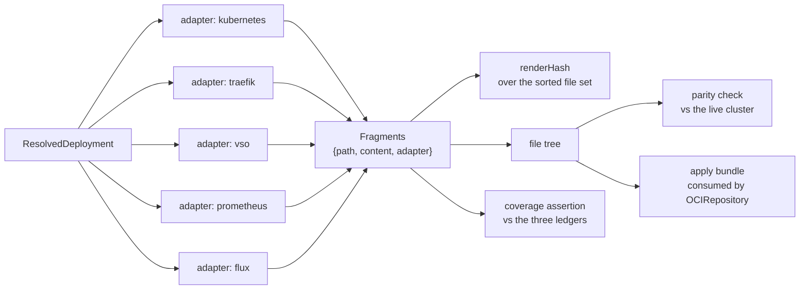

# Chapter 30 — Deliverable Set

Layer 3. Never authored, and — the property that makes the other two layers
worth separating — it contains **no decisions**.

## The rule

> A Fragment's content is a pure function of the Resolved Deployment, and its
> path is a pure function of its adapter and the object it carries.

Layer 2 decided everything (chapter 20). Layer 3 serialises. If a renderer has to
choose, the choice belongs one layer up, and the choice being made here is the
defect — because a decision taken during serialisation appears in no schema, is
recorded in no lock, and is invisible in the published projection a Service owner
reads back.

## Fragment

The unit of output and of attribution, already implemented as exactly this shape:

```ts
{ path: string, content: string, adapter: string }
```

Every Fragment names its producing adapter. That is what makes ADR-0016's
attribution assertion possible without new machinery, and it is why a blueprint
pack is not a special case — a pack **is a list of Fragments**, each tagged
`adapter: flux-packs`:

```json
{
  "path": "platform/cluster/flux/apps/core/metallb/namespace.yaml",
  "content": "apiVersion: v1\nkind: Namespace\nmetadata:\n  name: \"metallb-system\"",
  "adapter": "flux-packs"
}
```

## Coverage, measured

[ADR-0016](../../docs/adr/0016-deliverables-and-ledgers.md) required each adapter
to become total for its target subsystem and recorded the cost as unmeasured.
This is the measurement, which closes open item 8.

Counted across `fleet-infra/cluster`, excluding
`flux-system/gotk-components.yaml` — the Flux installer, which contributes 32
objects of its own and is not rendered from anything: **450 objects, 39 distinct
kinds, 329 files.**

`kind: Kustomization` is two unrelated APIs and must be counted separately:
**74** are `kustomize.config.k8s.io/v1beta1` (a file list, one per directory) and
**15** are `kustomize.toolkit.fluxcd.io/v1` (a Flux reconcile unit). A coverage
claim that conflates them is wrong by 74.

### Three classes of Deliverable

| class | objects | share | how it is produced |
|---|---|---|---|
| **A — derived from Service Intent** | 364 | 81% | an adapter, per Service |
| **B — pack-delivered platform infrastructure** | 41 | 9% | `flux-packs` / `flux-source` from `flux-modules` at a pinned ref (ADR-0001) |
| **C — authored content** | 45 | 10% | not derivable; belongs in a ledger |

Class C is entirely Grafana: 31 `GrafanaDashboard` and 14 `GrafanaFolder`. A
dashboard is authored content, like an Asset — nothing in Service Intent implies
its panels. Attempting to derive it would be inventing a dashboard DSL.

Class B is `HelmRelease` (17), `HelmRepository` (13), `GitRepository`,
`ClusterIssuer`, `Certificate`, `IPAddressPool`, `L2Advertisement`, `TLSStore`,
`PriorityClass` (2), `RuntimeClass`, `Grafana`, `AlertmanagerConfig` — cert-manager,
MetalLB, Traefik, VSO and the observability stack, each already a pack:
`flux-core-metallb`, `flux-core-cert-manager`, `flux-core-traefik-{lan,public}`,
`flux-core-vso`, `flux-core-external-dns-cloudflare`, `observability-stack-pack`,
`observability-gatus-pack`, `edge-pack`, `edge-middleware-pack`,
`rabbitmq-data-service-pack`.

### The class A gap

Of the 364 objects that should come from an adapter, **328 have one and 36 do
not**:

| kinds | objects | state |
|---|---|---|
| `ServiceMonitor` 8, `PodMonitor` 2, `PrometheusRule` 1 | 11 | `render/servicemonitor.ts` exists but is **not a registered adapter** |
| `NetworkPolicy` | 3 | `render/networkpolicy.ts` exists but is **not registered** |
| `ClusterRole` 6, `ClusterRoleBinding` 4, `Role` 4, `RoleBinding` 2 | 16 | no adapter, no renderer |
| `PodDisruptionBudget` | 6 | no adapter, no renderer |

So the totality gap is **36 objects, 8% of the tree** — not the 19% a naive count
of unregistered *kinds* suggests. Of the 36, **14 need only registering** (a
renderer already exists) and **22 need writing**.

The `PodDisruptionBudget` row also strengthens a proposal chapter 10 left
ungraded. A PDB is exactly `minAvailable` serialised, and six already exist —
which is an argument for that field beyond replica arithmetic.

### The adapter set is not yet clean

Sixteen adapters are registered, and four are duplicated pairs from two
generations: `traefik-public` alongside `traefik-route-fragment`, `gatus`
alongside `gatus-endpoint-fragment`, `edge-catalog` alongside
`edge-catalog-fragment`, `image-metadata` alongside `image-metadata-fragment`.
Attribution is only meaningful if one adapter owns a kind, so the pairs must
collapse before the coverage assertion can be enforced.

## The normative adapter set

| adapter | owns |
|---|---|
| `kubernetes` | `Deployment`, `StatefulSet`, `Job`, `CronJob`, `Service`, `ServiceAccount`, `Namespace`, `ConfigMap`, `PersistentVolumeClaim` |
| `rbac` | `ServiceAccount` bindings — `Role`, `RoleBinding`, `ClusterRole`, `ClusterRoleBinding` |
| `availability` | `PodDisruptionBudget` |
| `traefik` | `IngressRoute`, `Middleware` |
| `vso` | `VaultConnection`, `VaultAuth`, `VaultStaticSecret`, `VaultDynamicSecret` |
| `prometheus` | `ServiceMonitor`, `PodMonitor`, `PrometheusRule` |
| `networking` | `NetworkPolicy` |
| `gatus` | the endpoints ConfigMap |
| `edge-catalog` | the two edge catalog ConfigMaps |
| `image-metadata` | the image metadata object |
| `flux` | Flux `Kustomization`, and the cluster root |
| `flux-source` / `flux-packs` | `GitRepository`, `HelmRepository`, `HelmRelease`, and every pack Fragment |
| *(every adapter)* | the kustomize `Kustomization` listing its own directory |

`ServiceAccount` appears twice deliberately: `kubernetes` creates it, `rbac` binds
it. That is two Fragments about one object, which is allowed — attribution is per
Fragment, and ADR-0016's single-authority property is per **field**, not per
object.

## Path allocation

Paths are deterministic and derived, never configured per Service. The existing
allocator already encodes the shape:

```
<gitopsRoot>/apps/<reconcileUnit>/<service>/<fragment>.yaml
<gitopsRoot>/apps/edge/traefik-ingressroutes.yaml
<gitopsRoot>/apps/<gatusGroup>/gatus/gatus-endpoints-configmap.yaml
<gitopsRoot>/clusters/<cluster>/kustomizations.yaml
```

Two constraints hold: a path is always relative and normalised — `safeRelativePath`
rejects `..` and absolute paths — and two adapters may never claim the same path.
A collision is a build error, not a last-write-wins merge.

## Prune is the reason coverage matters

An object the render omits is an object deleted from the cluster — which converts
every coverage gap from an inconvenience into a deletion risk, and is why the
assertions below are not hygiene.

**How that deletion happens differs by class after ADR-0019.** For class B, Flux
prunes on the next reconcile, because a Kustomization keeps an inventory of what
it applied. For class A there is no reconcile and `kubectl` keeps no inventory, so
one is supplied: every applied object carries a `deploy.jorisjonkers.dev/deployer`
label, and the delete pass is the difference between that query and the current
render (chapter 50). The consequence is identical; the mechanism is not.

It is also why ADR-0015's participants list exists: a domain that silently fails
to publish does not merely go stale, it gets deleted, and the render that deletes
it looks entirely valid.

## Three bidirectional ledgers

Each fails **both** when something is missing from it and when one of its entries
no longer matches anything, which is the property
`catalog/accepted-fragment-drift.yml` already has and states:

> *"fails on anything absent from this file, and also fails on an entry here that
> no longer matches anything — so the list cannot quietly outlive the thing it
> excuses. Every entry is a deferred fix, not a permanent exemption."*

| ledger | holds |
|---|---|
| coverage ledger | every live object with no producing adapter — today, class C's 45 Grafana objects plus the 36-object class A gap until it closes |
| accepted fragment drift | differences between the render and what services published, each a deferred fix |
| registered unmanaged surfaces | hostnames the model does not deploy (ADR-0010) |

One live drift entry shows where the limit genuinely is: `agent-gateway` cannot be
probed because it is *"a sidecar jar inside agent-runner pods, not a workload of
its own"*, and its per-runner Services are created and destroyed by `agents-api`
at runtime. Some objects are outside any declarative model, and the ledger is
where they belong — with a reason, not with silence.

## Determinism and parity



`renderHash` is taken over the sorted Fragment set, so it is stable against
emission order. Combined with chapter 20's purity rule this gives the property
that matters: **re-rendering from the recorded input digests produces a
byte-identical tree.** A mismatch means an input was not pinned.

The parity check compares the rendered tree against the live cluster by object
identity — `apiVersion/kind/namespace/name` — with a behavioural profile so that
coordinates differing for structural reasons do not read as drift. The estate's
own last comparison is the model for it: 324 objects, 316 identical once
account, publish-path and pin coordinates were neutralised, 8 differing and every
one explained. *"Anything left that is not in the table above is real drift and
needs a decision, not an allowlist entry."*

## Forbidden in a Deliverable

| forbidden | why |
|---|---|
| a raw `Secret` with a literal value | `raw-manifests-guard` scans for it; secrets arrive through VSO or are fetched |
| a `kind` on the forbidden list | `E_FORBIDDEN_KIND`; the guard reports kind, filename and line |
| an object in a namespace the Service does not own | `E_FOREIGN_NAMESPACE` |
| a floating image tag | `E_FLOATING_IMAGE`; digests only |
| a hand-added file inside the rendered tree | it will be pruned, or it will make parity permanently red |
| a path claimed by two adapters | attribution becomes ambiguous |
| a path outside the gitops root | `safeRelativePath` |

## Open in this chapter

1. **The four duplicated adapter pairs must collapse.** Attribution requires one
   owner per kind, and the `*-fragment` twins are a second generation that never
   replaced the first.
2. **Two adapters need writing, two need registering.** `rbac` (16 objects) and
   `availability` (6) do not exist at all — 22 objects. `prometheus` (11) and
   `networking` (3) have working renderers that were never registered as
   adapters — 14 objects, and the cheaper half of the gap.
3. ~~**Grafana dashboards need a home.**~~ **Resolved in chapter 50.** The 45
   objects divide by nature: 14 service-specific dashboards become Assets on the
   owning Service, 3 runtime-family dashboards ship with the Runtime Profile
   alongside the values it already injects, 14 platform dashboards ship in the
   observability pack, and `service-overview` / `service-template` become derived
   per Service from `scrape`, `runtime` and `exposure`. Coverage can therefore
   reach 100%, and the ledger needs no permanent entries.
4. **The gitops root path is still `platform/cluster/flux` in the allocator** while
   `fleet-infra` uses `cluster/flux`. One of the two is stale; the packs' Fragment
   paths carry the `platform/` prefix, which suggests the allocator predates the
   monorepo split.
