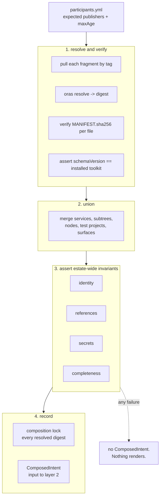

# Chapter 40 — Composition

Composition is the step that turns many independently-published declarations into
the single global view layer 2 needs. It runs before resolution, and nothing
downstream works without it.

## Why it exists

Seven properties in this specification cannot be evaluated against one repository
in isolation:

| property | needs |
|---|---|
| Service Id uniqueness (ADR-0004) | every Service in the estate |
| hostname label uniqueness (chapter 20) | every exposure in the estate |
| the Reconcile Unit DAG (ADR-0006) | every dependency edge |
| inbound derivations — CORS origins, one database per consumer (chapter 16) | edges pointing *at* a Service |
| the reader set of a secret path (ADR-0005) | every grant in the estate |
| reachability completeness (ADR-0010) | every exposure plus the unmanaged register |
| co-test membership (ADR-0014) | every test project's `exercises` list |

No Service knows its own consumers, so none of these are locally computable. That
is the whole argument for composition, and it is why ADR-0015 is a hard
dependency of chapters 16, 20 and 30.

## The Intent Fragment

The unit of publication is a **repository**, not a domain. A fragment declares
which domains it contributes to, so the two need not be one-to-one:

```yaml
apiVersion: intent.jorisjonkers.dev/v1
kind: IntentFragment
metadata:
  repository: JorisJonkers-dev/knowledge
  sourceSha: 22b9d332a9e059eaeebaffbe49ab25f762985029
spec:
  domains: [knowledge]
  contains:
    services: [knowledge]
    secretSubtrees: [knowledge-system/]
```

This refines ADR-0015's wording, which says "each domain repository publishes".
Repository-scoped publication resolves open item 5 without a decision:
`homelab-collections` may stay one repository publishing one fragment that
declares five domains, or split into five each publishing one. Composition
behaves identically, so the split becomes a convenience rather than a
prerequisite.

A fragment carries:

- Service documents (`service.yml`) and their env files
- the Secret Subtree the domain owns — paths, keys, engines, readers
- node declarations, for the fragment that owns the fleet
- `SystemTestProject` documents (ADR-0014)
- Registered Unmanaged Surfaces the domain is responsible for (ADR-0010)

## Publication, and why the lock is an output

A fragment is published as an OCI artifact on release, the pattern
`homelab-inventory` already runs for `cluster-deploy-context-{public,internal}`:

```
oras push  "$REF" --annotation ...
oras resolve "$REF"          # learn the digest AFTER pushing
```

That second line is the whole reason ADR-0015 makes the lock an output rather
than an input. **An artefact cannot contain its own digest.** The evidence is in
the tree: `context/public/context-manifest.yml` ships with `packageDigest: ""`,
because the digest does not exist until the push completes. A design where each
repository pinned its peers would require every fragment to know digests that
cannot be known at authoring time, so the digests are recorded by the
**consumer** — the composition lock — after resolution.

`oras resolve` following `oras push` is also the estate's habit applied
correctly: the push's exit code is not the digest, and the digest is what
downstream pins.

Two source hashes are kept distinct, following the same repository's design:

| hash | over | why |
|---|---|---|
| `sourceSha` | the git commit | provenance: which commit produced this |
| `inputsSha` | the authored inputs only, never generated outputs | change detection that does not chase its own tail |

`homelab-inventory` derives `inventorySourceSha` from
`inventory/ + catalog/ + vault/ + providers/` and **never** from the generated
`context/` tree, and the value is identical in the public and internal manifests.
That is the property to copy: a hash that included generated output would change
on every publish and detect nothing.

## Composition



Composition is **order-independent**: the same fragment set yields the same
`ComposedIntent` regardless of pull order. That is not a nicety, it is what makes
the composed digest meaningful — and it forces a design consequence. Every merge
must be commutative, so **every collision is an error rather than a
last-write-wins merge.** There is no precedence between fragments, and no fragment
can override another.

## The estate-wide invariants

Normative. Composition fails on any of these, and produces no `ComposedIntent`.

### Identity

| invariant | error |
|---|---|
| Service Ids are unique across the union | `E_DUPLICATE_SERVICE_ID` |
| exposure names are unique across the union | `E_DUPLICATE_EXPOSURE_NAME` |
| at most one Service claims the apex | `E_DUPLICATE_APEX` |
| Secret Store path prefixes do not overlap between Subtrees | `E_SUBTREE_PREFIX_COLLISION` |
| no two adapters claim one output path (chapter 30) | `E_PATH_COLLISION` |

### References

| invariant | error |
|---|---|
| every `dependsOn.service` resolves to a Service in the union | `E_UNRESOLVED_SERVICE` |
| every `dependsOn.surface` exists in that Service's `provides` | `E_UNKNOWN_SURFACE` |
| the graph of **required** edges is acyclic | `E_DEPENDENCY_CYCLE` |
| every `exercises` target of a test project resolves | `E_UNRESOLVED_TEST_TARGET` |
| every `placement.requires` and `prefers` capability is advertised by some node | `E_CAPABILITY_UNSATISFIABLE` |
| every exposure's audience is carryable by some tier | `E_NO_TIER_FOR_AUDIENCE` |

Optional edges are excluded from the cycle check deliberately. `required: false`
means a Workload starts without its peer, so a cycle through optional edges
cannot deadlock a rollout.

### Secrets

| invariant | error |
|---|---|
| every grant's path is declared by exactly one Subtree | `E_UNDECLARED_SECRET_PATH` |
| the Subtree lists the granting Service as a reader | `E_READER_NOT_DECLARED` |
| every `delivery: env` grant has a matching `${secret:…}` placeholder | `E_UNBOUND_SECRET_GRANT` |
| every `${secret:…}` placeholder has a matching grant | `E_UNAUTHORISED_SECRET_REFERENCE` |
| `access: self-roll` on a path with other readers carries an acknowledgement | `E_ROLL_AFFECTS_OTHER_READERS` |
| no literal secret value appears in an env file or an Asset | `E_RAW_SECRET` |

The fifth is the check nothing in the estate has today, and the case that
motivates it is live: `secret/platform/observability` holds the Prometheus token,
the Discord webhook and the Grafana client secret, and one CronJob rolls one of
those keys.

### Completeness

| invariant | error |
|---|---|
| every expected participant resolves | `E_PARTICIPANT_MISSING` |
| every participant's publish is within its `maxAge` | `E_PARTICIPANT_STALE` |
| reachability equals derived ∪ registered exactly | `E_UNREGISTERED_SURFACE` |
| every live object is attributable or ledgered (chapter 30) | `E_UNATTRIBUTED_OBJECT` |
| every ledger entry still matches something | `E_STALE_EXEMPTION` |

`E_PARTICIPANT_MISSING` is not pedantry. **Flux prunes**, so a domain that fails
to publish is not merely absent from the render — it is deleted from the cluster
on the next reconcile, by a render that looks entirely valid.

## The participants list

```yaml
participants:
  intent-nodes:         {maxAge: 30d}
  intent-data:          {maxAge: 90d}
  intent-knowledge:     {maxAge: 90d}
  intent-agents:        {maxAge: 90d}
  intent-media:         {maxAge: 180d}
  intent-observability: {maxAge: 90d, dormant: true,
                         reason: stable since 2026-03, reviewed: 2026-08-31}
  systest-auth-federation: {maxAge: 90d}
```

It is the one central artefact that survives, and it changes only when a domain
or a test project is added or retired — not when a declaration changes. Deriving
the expected set from inbound references was considered and rejected: a **leaf**
Service that nothing depends on can vanish without breaking any reference, and
leaves are the majority — `immich`, `jellyfin`, `sonarr`, `radarr`, `bazarr`,
`prowlarr`, `qbittorrent`.

`dormant: true` is an explicit exemption from the staleness bound, and it carries
a reason and a review date like every other Bidirectional Ledger entry.

## The composition lock

The output, generalising `cluster-composition-lock` from two pinned contexts to
N pinned fragments:

```yaml
apiVersion: resolved.jorisjonkers.dev/v1
kind: CompositionLock
metadata:
  cluster: production
  generatedAt: 2026-08-31T14:22:07Z
spec:
  schemaVersion: 1.0.0
  composedDigest: sha256:…            # of the ComposedIntent
  previousLockDigest: sha256:…
  lockChain:
    - {digest: sha256:…, commit: 22b9d33, timestamp: …}
  fragments:
    intent-knowledge:
      ref: ghcr.io/jorisjonkers-dev/intent-knowledge@sha256:…
      sourceSha: 22b9d33…
      inputsSha: 84021c5…
    intent-data: {…}
  context:
    ref: ghcr.io/jorisjonkers-dev/cluster-deploy-context-public@sha256:…
    inventorySourceSha: 84021c5…
```

`lockChain` is inherited deliberately: it answers "when did this fragment's digest
change, and which render did that produce" without diffing published artefacts.

Re-composing from a recorded lock pins every fragment by digest and must yield
the identical `composedDigest`. Combined with chapter 20's purity rule and
chapter 30's `renderHash`, that gives one unbroken chain from a published
fragment to a rendered file.

## Cross-service references

A reference is a Service Id and, where it names a connection, a surface name.
Resolution is a lookup in the union — no URL, no repository coordinate, no
network call at authoring time. Renaming a Service is therefore a breaking change
to every inbound reference, which is what `E_UNRESOLVED_SERVICE` reports, and the
`aliases` block (ADR-0004) exists so that a *coordinate* can diverge without the
identity moving.

## Open in this chapter

1. **Fragment publication trigger.** "On release" is underspecified. A service
   repository releases when its image releases, but a change to `service.yml`
   alone may not cut a release — so an intent change could sit unpublished
   behind a `maxAge` window. Either intent publishes on merge to the default
   branch independently of the image release, or `maxAge` is doing work it should
   not.
2. **Who runs composition, and how often.** Nothing here says whether it runs on
   a schedule, on any fragment publish, or only on demand. That choice determines
   how quickly a merged change reaches the cluster and how many renders happen
   per day.
3. **Whether the union may span clusters.** The lock is keyed by cluster, but the
   invariants — Service Id uniqueness in particular — are estate-wide rather than
   per-cluster. With one cluster the distinction is invisible; with two it needs
   deciding.
4. **Fragment signing.** The publish already produces attestations elsewhere in
   the estate (`id-token: write`, `attestations: write` in `deploy-artifact.yml`),
   and composition verifies `MANIFEST.sha256` per file but not provenance. Whether
   composition should require a verified signature is unaddressed.
