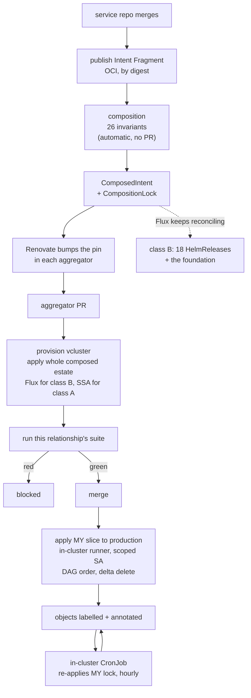

# Chapter 50 — Lifecycle

How a change reaches the cluster. This chapter replaces a pull-based GitOps
delivery model with a push-based one, gated by relationship-scoped aggregators —
see [ADR-0019](../../docs/adr/0019-push-delivery-via-aggregators.md) for the
decision and its costs.

## The stages

```
1. a service repo merges     -> publishes its Intent Fragment (OCI, by digest). No PR.
2. any fragment publishes    -> composition runs automatically: all 26 invariants,
                                then publishes ComposedIntent + CompositionLock. No PR.
3. Renovate                  -> bumps the composed-lock pin in each aggregator
4. the aggregator's PR       -> provision a vcluster, apply the whole composed estate,
                                run that relationship's suite
5. green                     -> merge
6. on merge                  -> apply MY slice to production
7. hourly, in-cluster        -> re-apply MY applied lock; idempotent
```

Only stages 4–6 involve a pull request, and it exists to **run tests**, not to
record pointers. Stages 1 and 2 need no merge at all, which is the property
ADR-0015 was protecting.

## Two delivery paths

Delivery splits exactly where chapter 30's measurement already split coverage,
which was not planned and is the strongest argument for the boundary:

| class | objects | delivered by | why |
|---|---|---|---|
| **A** — derived from Service Intent | 364 | an **aggregator**, `kubectl apply --server-side` | changes constantly; needs relationship testing |
| **B** — pack-delivered foundation | 41 | **Flux**, unchanged | 18 of them are `HelmRelease`, which does nothing without `helm-controller` |
| **C** — authored content | 45 | reassigned; see below | dashboards are not derivable |

Class B cannot move. Applying a `HelmRelease` with `kubectl` accomplishes
literally nothing unless Flux's `helm-controller` is running, and the 18 charts
are the foundation everything else stands on:

> `vault-secrets-operator` — **every secret under ADR-0005's `delivery: env`**.
> `metrics-stack` — Prometheus, and the referent of the `release: metrics-stack`
> label without which a `PrometheusRule` never evaluates. `vault` — the Secret
> Store itself. `traefik`, `traefik-lan` — every route. `cert-manager`,
> `external-dns` — TLS and DNS. `metallb` — LoadBalancer addresses. Plus
> `grafana`, `grafana-operator`, `loki`, `tempo`, `pyroscope`, `alloy` ×2,
> `dcgm-exporter`, `nvidia-device-plugin`, `headlamp`.

The boundary is enforced, not documented: an object's class decides its applier,
and both claiming one object is a build error. Server-side apply field managers
make double ownership visible at the API server rather than in a diff.

### Class C, resolved

Chapter 30 left 45 Grafana objects homeless. They divide by nature:

| group | count | owner |
|---|---|---|
| service-specific — `auth-api`, `knowledge-system`, `postgres-exporter`, `valkey-redis`, … | 14 | an **Asset** on the owning Service |
| runtime-family — `spring-boot-jvm`, `spring-boot-2.1`, `spring-service-endpoints` | 3 | the **Runtime Profile**, alongside the `OTEL_*` and `PYROSCOPE_*` values it already injects |
| platform — `flux-*`, `loki-logs`, `tempo-*`, `gatus-uptime`, `infrastructure-overview`, … | 14 | the **observability pack** (class B) |
| `service-overview` / `service-template` | 2 | **derived** per Service from `scrape`, `runtime` and `exposure` |

`service-template` becomes the renderer's template rather than a cluster object,
which is what its name has always implied. With every group assigned, coverage can
reach 100% and the coverage ledger stops needing permanent entries — which matters
because its own header says *"every entry is a deferred fix, not a permanent
exemption."*

## The aggregator

A repository owning a relationship. It carries two lists, and the distinction
between them is what makes overlap safe:

```yaml
apiVersion: intent.jorisjonkers.dev/v1
kind: Aggregator
metadata:
  repository: JorisJonkers-dev/systest-auth-federation
spec:
  exercises: [auth-api, auth-ui, home-portal, agents-ui,
              grafana, n8n, platform-rabbitmq]
  deploys:   [auth-api, auth-ui]
  pins:
    composedLock: ghcr.io/jorisjonkers-dev/composed@sha256:…
```

`exercises` is many-to-many: `auth-api` is exercised both by its pairing with
`auth-ui` and by the OIDC federation set, and the 12 auth relationship test
classes — `AuthFlow`, `ForwardAuthChain`, `GrafanaOidc`, `N8nOidc`,
`RabbitMqOidc`, `DownstreamOidcAuthorization` and the rest — span both.

`deploys` is one-to-one across the estate. Exactly one aggregator may apply a
given Service, so overlap yields many gates and one applier. Two new invariants
enforce it: `E_NO_DEPLOYER` and `E_MULTIPLE_DEPLOYERS`.

Every domain has a default aggregator so nothing is undeployable. The media
services need one: `jellyfin`, `sonarr`, `radarr`, `prowlarr`, `bazarr`,
`qbittorrent` and `immich` have **zero** test classes between them, so
`media-stack` deploys them behind smoke tests only.

## The apply

```
prev = kubectl get -l deploy.jorisjonkers.dev/deployer=<aggregator>
curr = render(my applied lock, services I deploy)

for obj in (prev - curr):  kubectl delete …          # prune
for obj in curr:           kubectl apply --server-side \
                             --field-manager=<aggregator>
```

Applied in `lock.spec.dependencyGraph.order`, which is how
`deploy-harness/scripts/apply-candidate.mjs` already applies a candidate to a
vcluster. Every applied object carries:

```yaml
labels:      {deploy.jorisjonkers.dev/deployer: auth-federation}
annotations: {deploy.jorisjonkers.dev/lock: sha256:…}
```

**The cluster is the inventory.** Flux can prune because a Kustomization keeps a
record of what it applied; `kubectl` keeps none, so the label supplies one. The
previous set is a query rather than a stored artefact, which means there is
nothing to lose, nothing to resync, and no first-run special case: on adoption
nothing is labelled, so the delete pass finds an empty previous set and deletes
nothing. Adoption leaves *orphans*, which are the coverage assertion's problem.

The residual risk is a label that drifts — such an object is invisible to the
delete pass and orphans silently.

## Drift

An **in-cluster CronJob per aggregator**, rendered like any other Deliverable,
running under the same ServiceAccount as the merge apply. It re-applies the lock
recorded in *its own* annotations, not the globally newest one.

GitHub Actions schedules were rejected on the estate's own measurement:

> *"Scheduled workflows fire far less often than their cron says… four to seven
> runs per repo per day regardless of the declared interval… Crons also run late
> by hours. Never build anything needing prompt reaction on a schedule alone, and
> do not raise the frequency to compensate."*

Drift correction is a reaction to something having gone wrong, so it is exactly
what that trap forbids putting on an Actions schedule. A cluster CronJob fires
when it says it does, costs no Actions minutes, and is the pattern
`vault-metrics-token-renewal` already uses — chosen there so that *"a few
consecutive failures are survivable rather than terminal."*

Server-side apply is idempotent, so a clean cluster is a no-op. A field-ownership
**conflict** means a human edited a field this aggregator owns: it is reported,
never resolved with `--force-conflicts`. That is one thing this model does better
than continuous reconciliation, which would silently revert the edit.

## Partial rollout

The cluster is a patchwork: each slice sits at whatever lock its aggregator
merged. There is no single answer to "what lock is production at", and forcing
convergence was rejected because one red aggregator would halt the estate — the
coupling aggregators exist to break.

Two mechanisms make the patchwork safe.

**Lag is measured.** The minimum lock annotation across an aggregator's objects,
compared against the newest published lock. Beyond a bound, it is reported.

**Contraction is checked.** Cross-slice derived values must go through
expand/contract, and composition can enforce it because it sees both sides of
every inbound derivation. `auth-api`'s CORS origins derive from inbound edges, so:

- **additive** — `auth-api` at lock N allows an origin not yet deployed: harmless
- **removal** — `auth-api` at lock N stops allowing an origin **still live** at
  N−1: broken

Removing a derived value while any slice still depends on it is
`E_CONTRACT_TOO_EARLY`.

## Rollback

**Normal:** revert the pin commit. The suite runs against the previous
combination and merges, so the rollback is itself tested.

**Break-glass:** a `workflow_dispatch` applies a named older lock directly,
skipping tests. Because the applied lock is read from the cluster's annotations,
the rollback **sticks** — the CronJob re-applies the older lock rather than
undoing the rollback within the hour. A git-stored record would have fought it.

A break-glass state must be reported — the cluster is behind the aggregator's
merged pin — or it becomes the silent status quo. The estate has precedent for
both the mechanism and the discipline: `scripts/ops/mint-vault-metrics-token.sh`
is documented break-glass, and `scripts/cutover/rollback-source.sh` is an
emergency rollback that undoes itself on a failed check.

## Credentials

The apply runs on a self-hosted runner **inside** the cluster, under a
ServiceAccount per aggregator. No cluster credential exists outside the cluster.
The `deploys` list generates that ServiceAccount's Role, so deploy authority is
enforced by the API server: a workflow that tries to apply a Service it does not
own receives a 403 rather than producing a bad deploy.

That makes the `rbac` adapter pay for itself twice. It was already 16 of the 36
objects in chapter 30's coverage gap; it now also renders the deployer identities
this chapter depends on.

## The pipeline



## What already exists

Most of stage 4 is built, in `tests/stack-integration-tests/deploy-harness`:

| exists | does |
|---|---|
| `provision-vcluster.mjs` | ephemeral vcluster + namespace |
| `apply-candidate.mjs` | server-side apply per DAG layer, with route rewriting to `.jorisjonkers.test` |
| `lib/kubectl.mjs` | kubectl wrapper, kubeconfig via temp file |
| `prepare-candidate.mjs` | the SC-6 triple-digest assertion before any apply |
| `seed-vault-approle.mjs` | a scoped Vault AppRole per test namespace |
| `wait-flux-ready.mjs`, `wait-runtime-healthy.mjs` | readiness and CrashLoop watch, VSO sync verification |
| `run-gradle-suite.mjs`, `rerun-policy.mjs`, `failure-classification.mjs`, `quarantine.mjs` | sharded execution, retry, transient classification, an owner-approved quarantine registry |
| `cleanup-target.mjs` | guaranteed teardown |
| `emit-gate-summary.mjs` | the SC-4 gate summary |

It is wired to a single central compose gate rather than to N aggregators. The
work is rewiring, not writing.

## Open in this chapter

1. **Aggregator CI cost.** A change anywhere invalidates every aggregator's pin,
   so ~6 suites run per service change. `CLAUDE.md` measures the billing shape:
   *"561 minutes of real compute billed 2,845 — four fifths of the spend was
   rounding"*, and *"prefer one job with many steps."* Sharded Gradle execution
   across parallel jobs is the opposite of that, so either sharding collapses or
   the cost is accepted deliberately.
2. **Whether the vcluster runs Flux for class B.** `wait-flux-ready.mjs` implies
   it does today. If production keeps Flux for the foundation, the test target
   should too, or the two paths diverge exactly where the foundation lives.
3. **The lag bound.** "More than N locks behind is reported" needs an N, and a
   decision about whether exceeding it blocks that aggregator's next merge.
4. **What replaces the `deploy/production` branch.** Flux still reads it for class
   B, so it survives — but narrowed to the foundation. ADR-0008 in the workspace
   records its current semantics and needs revisiting.
