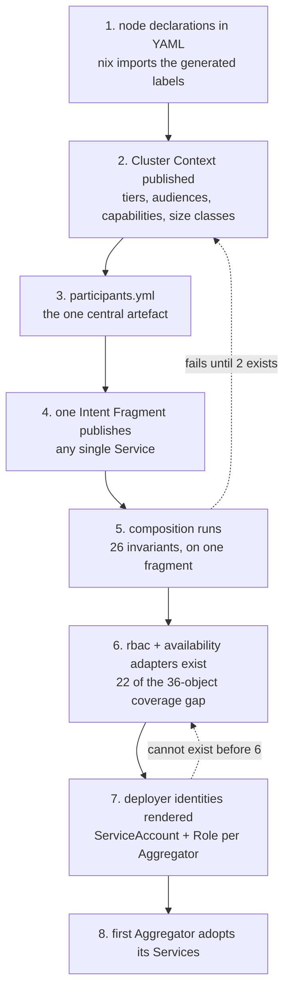

# Chapter 60 — Setup and adoption

How to stand this up, and how to move ~30 live Services onto it without
deleting any of them.

## Bootstrap order

Nothing here is optional and the order matters, because each step's checks
depend on the previous step's output existing.



Step 6 is the one that looks skippable and is not. An Aggregator's deployer
identity **is** rendered RBAC, so without the `rbac` adapter there is no
identity to apply under — and `availability` renders the `PodDisruptionBudget`
that `minAvailable` implies. Together they are 22 of the 36 objects in chapter
30's coverage gap, and they block adoption rather than merely being missing.

## Onboarding a new Service

1. Write `platform/service.yml` — id, domain, owner, alertClass, workloads.
2. Write `platform/env/<workload>/base.env` per workload, and a cluster overlay
   only where something differs.
3. Declare secrets in `service.yml` at the level they are shared, and reference
   env-delivered ones as `${secret:…}` placeholders in the env file. The two
   check each other.
4. Add `.github/workflows/publish-fragment.yml`
   ([example](examples/workflows/service-publish-fragment.yml)).
5. Register the repository in `participants.yml` with a staleness bound.
6. Add the Service to exactly one Aggregator's `deploys` list, or it can never
   deploy — `E_NO_DEPLOYER`.
7. Add it to any Aggregator's `exercises` list whose relationship it takes part
   in. That list is many-to-many.

Steps 5 and 6 are the two that a new Service cannot do for itself, and both fail
loudly rather than silently: an unregistered participant is invisible to
composition, and a Service with no deployer fails the union.

## Creating an Aggregator

A repository with four things
([full example](examples/aggregator.yml)):

| file | purpose |
|---|---|
| `aggregator.yml` | `exercises`, `deploys`, the composed-lock pin, the reapply schedule, the lag bound |
| `system-tests/` | the suite for this relationship |
| `renovate.json` | the custom manager tracking the one pin ([example](examples/renovate.json)) |
| `.github/workflows/` | [`gate.yml`](examples/workflows/aggregator-gate.yml) and [`deploy.yml`](examples/workflows/aggregator-deploy.yml) |

Every domain needs a default Aggregator, or Services in no relationship cannot
deploy. The media set needs one immediately: `jellyfin`, `sonarr`, `radarr`,
`prowlarr`, `bazarr`, `qbittorrent` and `immich` have **zero** test classes
between them, so it deploys them behind smoke tests only.

## Adopting a live Service

This is the dangerous part. Flux currently owns everything, and **Flux prunes**
— so removing a Service's manifests from the Flux source before the Aggregator
owns them deletes it from the cluster.

The order below is the safe one. Getting steps 2 and 4 the wrong way round
deletes production.

```
1. Publish the Service's Intent Fragment and let composition accept it.
   Nothing is applied. If the invariants reject it, nothing has changed.

2. Set `spec.prune: false` on the Flux Kustomization covering the Service.
   ---- THIS STEP FIRST. It is what makes step 4 non-destructive. ----

3. Aggregator applies its slice.
   Server-side apply takes field ownership and adds the deployer label. Flux is
   no longer pruning, so both managers coexisting is harmless.

4. Remove the Service's manifests from the Flux source and reconcile.
   Flux forgets them WITHOUT deleting them, because prune is off.

5. Verify: `kubectl get -l deploy.jorisjonkers.dev/deployer=<aggregator>`
   returns the expected set, and the objects carry the lock annotation.

6. Restore `spec.prune: true` on the Flux Kustomization.
   Its inventory no longer contains the Service, so there is nothing to prune.
```

Step 2 exists because a Flux Kustomization prunes objects that are in its
inventory and absent from its source. Removing manifests while prune is on is
precisely that condition.

`CLAUDE.md` adds a timing constraint to step 4: *"Flux reads `deploy/production`,
which a workflow publishes from `main`… After merging, wait for the publish to
land before reconciling — reconciling early silently applies the previous
revision."* Reconciling before the publish lands would restore the manifests you
just removed.

### What adoption leaves behind

On the first apply nothing is labelled yet, so the prune pass finds an empty
previous set and deletes nothing. That is the intended behaviour and it means
adoption is safe, but it also means **any live object not in the render becomes
an orphan** — unlabelled, unpruned, and invisible to every later delete pass.

Orphans are the coverage assertion's problem, not the delete pass's. Expect
them, and expect the coverage ledger to grow during adoption and shrink as
adapters become total. The 36-object gap is where most of them will come from.

## Adoption order across the estate

Adopt in dependency order, providers before consumers, so a consumer is never
applied against a provider that has not yet published a fragment:

```
1. intent-nodes           node declarations; nothing depends on it, everything reads it
2. intent-data            postgres, valkey, rabbitmq -- 8 Services depend on them
3. intent-auth            auth-api, auth-ui; 12 test classes and every forward-auth route
4. intent-knowledge       depends on data
5. intent-agents          depends on knowledge and vso-secrets
6. intent-media           the largest set, the fewest tests, the lowest risk
7. intent-mail, utility   the remainder
```

`intent-auth` third rather than last is deliberate: it has by far the best test
coverage, so it is where the pipeline gets proven. `intent-media` late is also
deliberate — zero test classes means the gate cannot tell you much, so it should
run on machinery already trusted.

## What has to be true before the first production apply

A checklist, because each item is something that fails silently if missing:

- [ ] Kubernetes secrets-at-rest encryption is enabled — ADR-0005 makes
      `delivery: env` and `delivery: file` conditional on it, and no
      `--secrets-encryption` configuration exists in-tree today
- [ ] `rbac` and `availability` adapters exist, and the four duplicated adapter
      pairs have collapsed, so attribution is unambiguous
- [ ] every Service has exactly one deployer
- [ ] one negative fixture exists per invariant, and the compose workflow runs
      them — an assertion that stopped running looks identical to one that passes
- [ ] default-deny NetworkPolicy is in **audit** mode, not enforce
- [ ] the self-hosted in-cluster runner exists, with a ServiceAccount per
      Aggregator and no kubeconfig outside the cluster
- [ ] a break-glass rollback has been rehearsed, not just written
